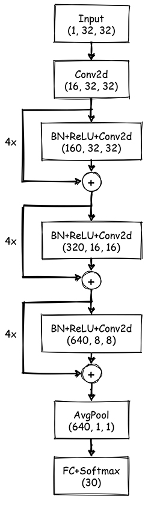

# Speech Commands Recognition

## 内容介绍

https://zhuanlan.zhihu.com/p/331833198

## 实验结果

| Local CV Score | Test Score    |
| -------------- | ------------- |
| 0.977 ± 0.001​  | 0.975 ± 0.001 |


本方案基于pytorch和[keras4torch](https://github.com/blueloveTH/keras4torch)。为方便移植到其他框架测试，下面列出了训练用到的主要设定。

## 主要设定

| setting           | value                        |
| ----------------- | ---------------------------- |
| features          | 1x32x32 melspectrogram       |
| model             | wide resnet28                |
| total parameters  | 36491726                     |
| epochs            | 40                           |
| batch size        | 96                           |
| optimizer         | SGD with momentum            |
| learning rate     | 1e-2 -> 3e-3 -> 9e-4 -> 8e-5 |
| L2 regularization | 1e-2                         |
| label smoothing   | 0.1                          |
| epoch time        | 82s (1 * RTX 2080Ti)         |


## 模型结构



## 运行仓库代码

#### 环境配置

```txt
torch>=1.6.0
keras4torch==1.1.3
scikit-learn==0.23.2

librosa==0.8.0
```

如果使用linux系统，需要先执行如下命令才能安装librosa。

```bash
! sudo apt-get install -y libsndfile1
```


#### 数据预处理

确保原始数据被放在data/ 文件夹中，运行preprocess.ipynb。

这些文件的结构如下：

- data/
  - train/
  - test/
- preprocess.ipynb
- train.ipynb


#### 训练和预测

在上一步完成的基础上，运行train.ipynb。

结束后，对测试集的预测（概率值）将被保存为一个.npy文件。


## 问题反馈

+ [Github Issue](https://github.com/blueloveTH/speech_commands_recognition/issues)
+ Email: blueloveTH@foxmail.com